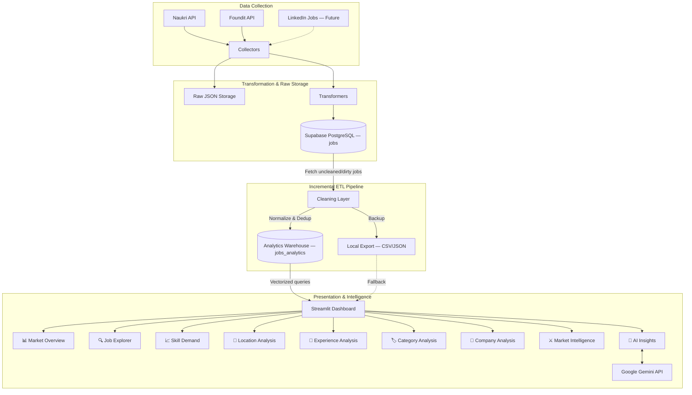

# CareerLens AI

### AI-Powered Job Market Intelligence & Career Analytics Platform

---

## Overview

CareerLens AI is a **Job Market Intelligence System** that helps AI/ML/Data Science professionals understand the real hiring landscape using live job data collected from multiple job portals.

Instead of relying on generic career advice, CareerLens AI:

1. **Collects** real-world job postings from Naukri and Foundit
2. **Cleans & standardizes** the data through a full ETL pipeline
3. **Stores** it in a centralized analytics warehouse (Supabase PostgreSQL)
4. **Visualizes** market trends through an interactive Streamlit dashboard
5. **Provides AI insights** using Google Gemini — grounded in actual market data

The core question it answers:

> "What skills should I learn to maximize my chances of getting hired?"

using actual hiring data rather than assumptions.

---

## Problem Statement

Most students and freshers:

- Learn random technologies without market context
- Follow outdated roadmaps
- Have no visibility into current hiring trends
- Don't know whether their skills match market demand
- Can't easily compare career paths (Data Science vs Data Analytics)

**CareerLens AI solves this** by creating a continuously updated job market intelligence system with data-driven career guidance.

---

## What Makes CareerLens Different?

| Feature | Naukri / Foundit | CareerLens AI |
|---|---|---|
| Show jobs | ✅ | ✅ |
| Search jobs | ✅ | ✅ |
| **Understand the job market** | ❌ | ✅ |
| **Compare career paths** | ❌ | ✅ |
| **Skill demand analysis** | ❌ | ✅ |
| **City-wise market intelligence** | ❌ | ✅ |
| **AI-powered career advice** | ❌ | ✅ |
| **Data-backed skill roadmaps** | ❌ | 🔜 |

---

## Dashboard Features

### 📊 Market Overview
KPI cards, category distribution, source breakdown, city rankings, and work mode analysis.

### 🔍 Job Explorer
Search and inspect actual job postings with full details — title, company, skills, experience, location, and direct links to original postings.

### 📈 Skill Demand
Top skills by frequency, skill co-occurrence heatmap, and percentage tables showing which skills appear in the most job postings.

### 📍 Location Analysis
City-wise job distribution, state mapping, and city × skill heatmaps showing which skills are most demanded in each city.

### 💼 Experience Analysis
Experience band distribution (Fresher, Junior, Mid, Senior, Lead), category × experience cross-tabulation.

### 🏷️ Category Analysis
Job category distribution, top skills per category comparison, and category × city heatmap.

### 🏢 Company Analysis
Top hiring companies, company skill profiles, and company location spread.

### ⚔️ Market Intelligence
**The differentiator.** Side-by-side comparisons that you can't get from Naukri or Foundit:

- **Category vs Category** — Data Science vs Data Analytics
- **City vs City** — Bangalore vs Hyderabad
- **Work Mode vs Work Mode** — Remote vs Onsite

Each comparison shows: total jobs, top skills, experience distribution, and top companies.

### 🤖 AI Insights
Auto-generated market insight cards (no API key required) plus optional Gemini-powered natural language Q&A:

- "What skills should I learn for Machine Learning?"
- "Which city has the most fresher-friendly jobs?"
- "Compare MLOps vs Generative AI demand"

The AI answers using **only real market data** — never general knowledge.

---

## Quick Start

### Prerequisites

- Python 3.10+
- Supabase account (for data storage)
- Google Gemini API key (optional, for AI Insights)

### Installation

```bash
# Clone the repository
git clone https://github.com/your-username/career-lens-ai.git
cd career-lens-ai

# Create virtual environment
python -m venv .venv
.venv\Scripts\activate  # Windows
# source .venv/bin/activate  # Linux/Mac

# Install dependencies
pip install -r requirements.txt

# Configure environment variables
cp .env.example .env
# Edit .env with your Supabase credentials and optional Gemini API key
```

### Run the Data Pipeline

```bash
# Collect from Foundit
python main.py --source foundit

# Collect from Naukri
python main.py --source naukri

# Re-run cleaning only (no collection)
python main.py --clean-only

# Dry run (preview without uploading)
python main.py --source foundit --dry-run
```

### Launch the Dashboard

```bash
streamlit run dashboard/app.py
```

The dashboard opens at `http://localhost:8501`.

---

## Architecture

### High-Level Architecture

```text
Job Portals (Naukri + Foundit)
    │
    ▼
Collectors (API scraping with Retry & Rate Limiting)
    │
    ▼
Transformers (Source schema → Standard schema)
    │
    ▼
Raw Data Warehouse (Supabase PostgreSQL — jobs table)
    │
    ▼ (Incremental Fetch: uncleaned or recently updated)
Cleaning Layer (Dedup, Location/Skill Normalization, Classification)
    │
    ▼
Analytics Warehouse (Supabase PostgreSQL — jobs_analytics table)
    │
    ▼ (Vectorized Data Fetching & Aggregation)
Streamlit Dashboard (Modular 9-Tab Architecture)
    │
    ▼
Gemini AI Engine (Market-Aware Insights & Q&A)
```

### Mermaid Architecture Diagram



---

## Tech Stack

| Layer | Technology |
|---|---|
| **Backend** | Python |
| **Data Collection** | Requests, curl-cffi |
| **Data Processing** | Pandas, NumPy |
| **Database** | PostgreSQL, Supabase |
| **Dashboard** | Streamlit |
| **Visualization** | Plotly, Matplotlib, Seaborn |
| **AI/LLM** | Google Gemini API |
| **Notebooks** | Jupyter Notebook |
| **Version Control** | Git, GitHub |

---

## Project Structure

```text
career-lens-ai/
│
├── collector/
│   ├── foundit_collector.py       # Foundit API scraper
│   └── naukri_collector.py        # Naukri API scraper
│
├── transformer/
│   ├── foundit_transformer.py     # Foundit → Standard schema
│   └── naukri_transformer.py      # Naukri → Standard schema
│
├── cleaning/
│   └── cleaner.py                 # Dedup, normalize, classify
│
├── database/
│   ├── schema.sql                 # Raw jobs table DDL
│   ├── schema_analytics.sql       # Analytics warehouse DDL
│   └── supabase_client.py         # Supabase API client
│
├── dashboard/
│   ├── app.py                     # Streamlit dashboard (9 tabs)
│   └── ai_engine.py               # Gemini AI insight engine
│
├── data/
│   ├── raw/                       # Raw API responses (gitignored)
│   └── processed/                 # Cleaned CSV/JSON exports
│
├── notebooks/
│   └── job_market_analysis.ipynb  # Exploratory analysis
│
├── docs/
│   ├── foundit_schema.txt         # API schema reference
│   └── naukri_schema.txt          # API schema reference
│
├── .streamlit/
│   └── config.toml                # Dashboard theme config
│
├── main.py                        # CLI pipeline entry point
├── requirements.txt               # Python dependencies
├── .env.example                   # Environment template
└── README.md
```

---

## Current Development Stage

### Phase 1 ✅ (Completed)

- Foundit API discovery and reverse engineering
- Naukri API integration
- Job collector development for both sources
- Raw JSON storage
- Schema discovery
- Supabase integration and initial database loading

### Phase 2 ✅ (Completed)

- Data Cleaning Layer (deduplication, normalization)
- Location standardization (Bangalore/Bengaluru → Bangalore)
- Skill normalization (200+ alias mappings)
- Experience parsing
- Job category classification (8 categories)
- HTML stripping from descriptions
- Local file export (CSV + JSON)

### Phase 3 ✅ (Completed)

- Interactive Streamlit dashboard with 9 tabs
- Global filter system (keyword, category, city, experience, source)
- Market Intelligence comparisons (Category vs Category, City vs City)
- AI Insight engine with Gemini integration
- Job Explorer for inspecting individual postings
- Plotly interactive charts with dark theme

### Phase 4 (Planned)

- Resume Scanner
- Skill Gap Analysis (user skills vs market demand)
- Resume Match Score

### Phase 5 (Planned)

- Market-Aware Career Roadmap Generator
- Personalized learning path based on real market data

---

## AI Features Roadmap

CareerLens AI uses a staged approach to adding intelligence:

### AI Layer 1: Market Q&A ✅
User asks a question → system queries the analytics database → Gemini generates a data-backed answer.

### AI Layer 2: Skill Gap Analysis (Planned)
User uploads resume → system extracts skills → compares against market demand → generates missing skills report.

### AI Layer 3: Market-Aware Roadmaps (Planned)
User says "I want to become a Data Scientist" → system uses real market data to generate a learning roadmap ordered by actual demand.

### AI Layer 4: Career Predictor (Planned)
"Is MLOps worth learning?" → system analyzes trend data → predicts future demand.

### AI Layer 5: Job Market Intelligence Agent (Planned)
"Compare Data Science vs Data Analytics in India" → agent runs complex queries → generates comprehensive market reports.

### ML Models (When Data Volume Grows)

| Model | When | Purpose |
|---|---|---|
| Job Category Classification | 50k+ jobs | Auto-classify new job titles |
| Salary Prediction | 100k+ jobs | Estimate salary ranges |
| Demand Forecasting | 6+ months of data | Predict future skill demand |

**Current approach:** SQL + Analytics + Gemini API (no training required).

---

## Workflow

### Step 1: Data Collection
Collectors fetch job data from Naukri and Foundit APIs with pagination, rate limiting, and retry logic. Raw API responses are saved locally (`data/raw/`) for auditing.

### Step 2: Transformation & Raw Storage
Source-specific schemas are converted to a unified CareerLens schema. These records are upserted into the Supabase PostgreSQL `jobs` table, utilizing `source` and `source_job_id` to deduplicate incoming data.

### Step 3: Incremental Cleaning & Analytics
The ETL pipeline intelligently fetches only "uncleaned" or "dirty" jobs (via `cleaned_at` and `updated_at` timestamps). It runs a full cleaning pipeline (fingerprint dedup, location/skill normalization, and job classification) and upserts the results into the `jobs_analytics` table. Stale jobs (not seen recently) are marked inactive.

### Step 4: Streamlit Dashboard
The dashboard connects directly to Supabase, pulling down analytics data into a Pandas DataFrame. It utilizes **vectorized operations** (like `df.explode()` and `groupby()`) rather than loops to rapidly compute insights across 9 interactive tabs with a robust Plotly layout engine.

### Step 5: AI Insights
Optional Gemini integration allows for natural language market intelligence queries, grounded completely in the actual, collected job market data.

---

## Future Features

### Resume Intelligence

```text
Upload Resume → Extract Skills → Compare Against Market → Generate Skill Gap Report
```

### Market-Aware Career Roadmap Generator

```text
"I want to become a Data Scientist"
→ Current Market Demand: Python 82%, SQL 76%, ML 65%, Power BI 42%
→ Suggested Learning Order: Month 1: Python → Month 2: SQL → Month 3: Statistics → ...
```

This is AI powered by actual job market data — not generic internet advice.

---

## Learning Outcomes

This project demonstrates:

### Data Engineering
- API Integration and reverse engineering
- ETL Pipeline Development
- Data Cleaning and Validation
- Database Design

### Data Analysis
- Exploratory Data Analysis
- Market Trend Detection
- Competitive Intelligence

### Full-Stack Analytics
- Interactive Dashboard Development (Streamlit + Plotly)
- LLM Integration (Gemini API)
- Modular, production-oriented architecture

---

## Author

**Abhishek Yadav**

Data Science Engineer

Building CareerLens AI to understand and navigate the AI/ML job market using real-world hiring data.