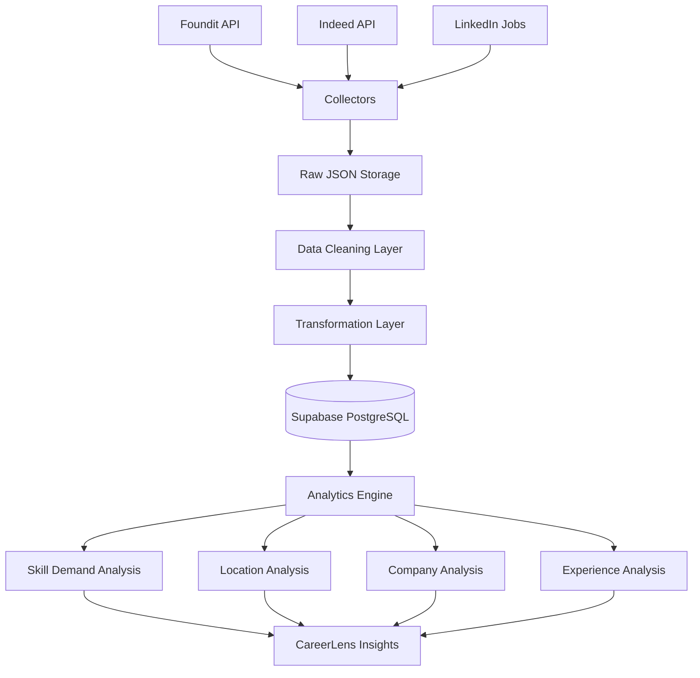

# CareerLens AI
### AI-Powered Job Market Intelligence & Career Analytics Platform

---

## Overview

CareerLens AI is a personal data engineering and analytics platform designed to help aspiring AI/ML/Data Science professionals understand the real job market using live job data collected from multiple job portals.

Instead of relying on generic career advice, CareerLens AI gathers real-world job postings, cleans and standardizes the data, stores it in a centralized database, and generates actionable insights such as:

- Most demanded AI/ML skills
- Top hiring companies
- Bengaluru vs Hyderabad job opportunities
- Experience-level demand trends
- Emerging technologies in job descriptions
- Resume-to-market fit analysis (future feature)

The primary goal is to answer:

> "What skills should I learn to maximize my chances of getting hired?"

using actual market data rather than assumptions.

---

# Problem Statement

Most students and freshers:

- Learn random technologies
- Follow outdated roadmaps
- Have no visibility into current hiring trends
- Don't know whether their skills match market demand

CareerLens AI solves this by creating a continuously updated job market intelligence system.

---

# Objectives

The platform aims to:

### Data Collection

Collect AI/ML/Data Science jobs from multiple sources:

- Foundit
- Indeed
- LinkedIn (future)
- Naukri (future)

---

### Data Engineering

Build a complete ETL pipeline:

- Data Collection
- Data Validation
- Data Cleaning
- Data Standardization
- Data Storage

---

### Analytics

Generate insights such as:

- Top Skills by Frequency
- Skill Demand Growth
- Location-wise Hiring Trends
- Company-wise Hiring Trends
- Experience Level Analysis

---

### Career Intelligence

Provide personalized recommendations:

- Skill Gap Analysis
- Resume Match Score
- Recommended Technologies
- Recommended Learning Path

---

# Current Development Stage

### Phase 1 (Completed)

- Foundit API discovery
- API reverse engineering
- Job collector development
- Raw JSON storage
- Schema discovery
- Supabase integration
- Initial database loading

---

### Phase 2 (In Progress)

- Data Cleaning Layer
- Duplicate Detection
- Data Validation
- Data Standardization

---

### Phase 3 (Planned)

- Analytics Engine
- Dashboard Development
- Market Trend Analysis

---

### Phase 4 (Planned)

- Resume Scanner
- Resume vs Market Comparison
- Skill Recommendation Engine

---

# Tech Stack

## Backend

- Python

## Data Collection

- Requests
- JSON

## Data Processing

- Pandas
- NumPy

## Database

- PostgreSQL
- Supabase

## Data Visualization

- Matplotlib
- Seaborn
- Plotly

## Notebook Environment

- Jupyter Notebook

## Development Environment

- VS Code

## Version Control

- Git
- GitHub

---

# Project Structure

```text
career-lens-ai/

│
├── collector/
│   ├── foundit_collector.py
│
├── data/
│   ├── raw/
│   ├── processed/
│
├── notebooks/
│
├── docs/
│   └── foundit_schema.txt
│
├── cleaning/
│
├── transformers/
│
├── analytics/
│
├── dashboard/
│
├── config/
│
├── requirements.txt
│
└── README.md
```

---

# Architecture

## High-Level Architecture

```text
Job Portals
    │
    ▼
Collectors
    │
    ▼
Raw Data Storage
    │
    ▼
Cleaning Layer
    │
    ▼
Transformation Layer
    │
    ▼
Supabase/PostgreSQL
    │
    ▼
Analytics Engine
    │
    ▼
Insights & Recommendations
```

---

# Mermaid Architecture Diagram



---

# Workflow

## Step 1: Data Collection

The collector fetches job data from job portals.

Example:

```json
{
  "title": "AI Engineer",
  "companyName": "Adobe",
  "skills": [
    {
      "text": "MLflow"
    }
  ]
}
```

---

## Step 2: Raw Storage

Store the original API response without modifications.

Purpose:

- Backup
- Debugging
- Reprocessing

Location:

```text
data/raw/
```

---

## Step 3: Data Cleaning

Handle:

- Missing values
- Null values
- Inconsistent skills
- Invalid locations
- Incorrect dates

Examples:

```text
Bangalore
Bengaluru
Bengaluru / Bangalore
```

becomes

```text
Bengaluru
```

---

## Step 4: Deduplication

Detect duplicate jobs across sources.

Example:

```text
Adobe - AI Engineer
```

appearing on:

- Foundit
- Indeed

Store only one canonical version.

---

## Step 5: Transformation

Convert source-specific schema into a common schema.

Example:

### Source Schema

```json
{
  "companyName": "Adobe"
}
```

### Internal Schema

```json
{
  "company": "Adobe"
}
```

---

## Step 6: Database Storage

Store cleaned records into PostgreSQL.

Example Table:

```sql
jobs
```

Columns:

```sql
id
title
company
location
salary
skills
experience
posted_date
source
```

---

## Step 7: Analytics

Perform analysis such as:

### Skill Frequency

```text
Python      82%
AWS         60%
MLflow      41%
```

---

### Location Trends

```text
Bengaluru   420 jobs
Hyderabad   310 jobs
Pune        180 jobs
```

---

### Company Trends

```text
TCS
Capgemini
Adobe
Accenture
Infosys
```

---

# Future Features

## Resume Intelligence

Upload Resume

↓

Extract Skills

↓

Compare Against Market

↓

Generate Skill Gap Report

---

## AI Career Advisor

Input:

```text
Current Skills:
Python
SQL
Pandas
```

Output:

```text
Most Missing Skills:
- MLflow
- AWS
- LangChain
- Docker
```

---

# Learning Outcomes

This project demonstrates:

### Data Engineering

- API Integration
- ETL Pipeline Development
- Data Cleaning
- Data Validation
- Database Design

### Data Analysis

- Exploratory Data Analysis
- Trend Detection
- Market Intelligence

### Software Engineering

- Modular Architecture
- Scalable Design
- Production-Oriented Thinking

---

# Author

Abhishek Yadav

Final Year Data Science Engineering Student

Building CareerLens AI to understand and navigate the AI/ML job market using real-world hiring data.