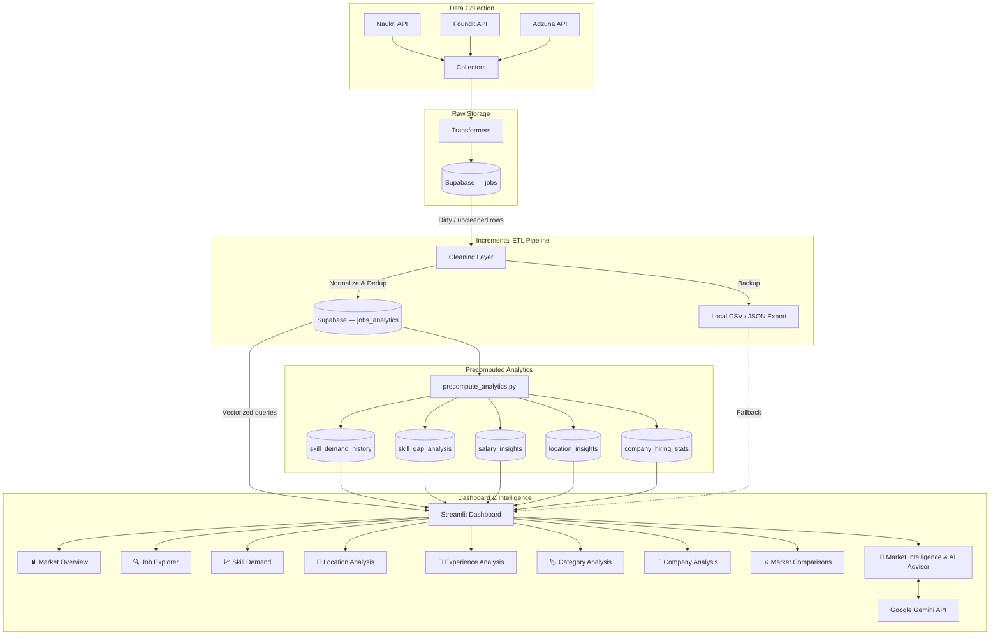

# CareerLens AI

### AI-Powered Job Market Intelligence & Career Analytics Platform

---

## Overview

CareerLens AI is a **Job Market Intelligence System** that helps AI/ML/Data Science professionals understand the real hiring landscape using live job data collected from multiple job portals across India.

Instead of relying on generic career advice, CareerLens AI:

1. **Collects** real-world job postings from Naukri, Foundit, and Adzuna
2. **Cleans & standardizes** the data through a full incremental ETL pipeline
3. **Precomputes** analytics — skill demand history, gap scores, salary intel, and location trends — into dedicated tables
4. **Visualizes** market trends through an interactive 9-tab Streamlit dashboard
5. **Provides AI career strategy** using Google Gemini — grounded in actual, live market data (no hardcoded statistics)

The core question it answers:

> "What skills should I learn to maximize my chances of getting hired?"

using actual hiring data rather than assumptions.

---

## Problem Statement

Most students and freshers:

- Learn random technologies without market context
- Follow outdated roadmaps
- Have no visibility into current hiring trends
- Don't know whether their skills match market demand
- Can't compare career paths (e.g. Data Science vs Data Analytics)

**CareerLens AI solves this** by building a continuously updated job market intelligence system with data-backed career guidance.

---

## What Makes CareerLens Different?

| Feature | Naukri / Foundit | CareerLens AI |
|---|---|---|
| Show jobs | ✅ | ✅ |
| Search jobs | ✅ | ✅ |
| **Understand the job market** | ❌ | ✅ |
| **Skill gap analysis (demand vs supply)** | ❌ | ✅ |
| **Precomputed analytics warehouse** | ❌ | ✅ |
| **City-wise market intelligence** | ❌ | ✅ |
| **AI-powered career strategy advisor** | ❌ | ✅ |
| **Multi-domain pipeline orchestration** | ❌ | ✅ |
| **3-source data collection** | ❌ | ✅ |

---

## Dashboard Features

### 📊 Market Overview
KPI cards, category distribution, source breakdown, city rankings, and work mode analysis.

### 🔍 Job Explorer
Search and inspect actual job postings with full details — title, company, skills, experience, location, and direct links to original postings.

### 📈 Skill Demand
Top skills by frequency, skill co-occurrence heatmap, and percentage tables showing which skills appear in the most job postings.

### 📍 Location Analysis
City-wise job distribution, state mapping, and city × skill heatmaps showing which skills are most demanded in each city.

### 💼 Experience Analysis
Experience band distribution (Fresher, Junior, Mid, Senior, Lead), category × experience cross-tabulation.

### 🏷️ Category Analysis
Job category distribution, top skills per category comparison, and category × city heatmap.

### 🏢 Company Analysis
Top hiring companies, company skill profiles, and company location spread.

### ⚔️ Market Comparisons
Side-by-side comparisons unavailable on any job portal:

- **Category vs Category** — Data Science vs Data Analytics
- **City vs City** — Bangalore vs Hyderabad
- **Work Mode vs Work Mode** — Remote vs Onsite

Each comparison shows: total jobs, top skills, experience distribution, and top companies.

### 🧠 Labor Market Intelligence & AI Career Advisor *(New)*
The core differentiator — a fully data-driven intelligence layer powered by precomputed analytics:

**Overview & Freshness** — Pipeline health KPIs, connector status (Naukri, Foundit, Adzuna), and three radar charts:
- 🏗️ Top Job Field Demand Share (live snapshot)
- 💡 Most Common Skills (current demand index)
- 🔮 Future Skills Radar (gap score + trend growth = future priority score)

**Skill Gap Engine** — Compares India baseline talent supply against live job demand by academic stream (CS, Data Science, Electronics, Business, Finance, Design). Shows shortages, surplus skills, and a fully badged market verdict table.

**Tech Trends** — Historical skill demand index over time. Multi-select trendline charts to spot rising and falling technologies.

**Salary Intelligence** — Precomputed median salary by job field, city, and technology skill.

**AI Career Advisor** — Gemini-powered career strategy engine that reads real, live market data (top demanded skills, talent gaps, top hiring cities, salary benchmarks) and generates a personalized 5-section roadmap:
1. Blunt Market Assessment
2. Top 3 Skills to Acquire (with justification)
3. 6-Month Milestones Plan
4. Realistic Salary Range (INR)
5. Contrarian Insight

> The advisor only uses **real pipeline data** — if a data field is unavailable, Gemini is instructed not to fabricate numbers.

---

## Quick Start

### Prerequisites

- Python 3.10+
- Supabase account (for data storage)
- Google Gemini API key (optional, for AI Career Advisor)
- Adzuna API key (optional, for Adzuna source)

### Installation

```bash
# Clone the repository
git clone https://github.com/Abhishek-ygr2003/career-lens-ai.git
cd career-lens-ai

# Create virtual environment
python -m venv .venv
.venv\Scripts\activate  # Windows
# source .venv/bin/activate  # Linux/Mac

# Install dependencies
pip install -r requirements.txt

# Configure environment variables
cp .env.example .env
# Edit .env with your Supabase credentials and optional API keys
```

### Run the Data Pipeline

```bash
# Single keyword, single source
python main.py --source foundit --keyword "data scientist"
python main.py --source naukri --keyword "machine learning engineer"
python main.py --source adzuna --keyword "data engineer"

# Collect from all sources
python main.py --source all --keyword "generative ai engineer"

# Re-run cleaning only (no collection)
python main.py --clean-only

# Dry run (preview without uploading)
python main.py --source foundit --keyword "data scientist" --dry-run
```

### Run the Multi-Domain Full Pipeline Orchestrator

```bash
# Ingest all domains from all sources (clears DB first)
python run_full_pipeline.py

# Ingest specific domains only
python run_full_pipeline.py --domains "Data Science & AI,Cybersecurity"

# Skip DB clearing (incremental add)
python run_full_pipeline.py --no-clear

# Target a specific source
python run_full_pipeline.py --source naukri --max-pages 5

# Dry run the entire multi-domain sweep
python run_full_pipeline.py --dry-run
```

### Precompute Analytics

```bash
# Precompute skill demand history, gap analysis, salary intel, location trends
python database/precompute_analytics.py
```

### Launch the Dashboard

```bash
streamlit run dashboard/app.py
```

The dashboard opens at `http://localhost:8501`.

---

## Architecture

### High-Level Data Flow

```text
Job Portals (Naukri + Foundit + Adzuna)
    │
    ▼
Collectors (API scraping with Retry & Rate Limiting)
    │
    ▼
Transformers (Source schema → Unified CareerLens schema)
    │
    ▼
Raw Staging Table (Supabase PostgreSQL — jobs)
    │
    ▼ (Incremental: uncleaned or recently updated rows only)
Cleaning Layer (Dedup · Location Norm · Skill Norm · Classification)
    │
    ▼
Analytics Warehouse (Supabase PostgreSQL — jobs_analytics)
    │
    ├─▶ Precompute Analytics Job ──▶ skill_demand_history
    │                              ▶ skill_gap_analysis
    │                              ▶ salary_insights
    │                              ▶ location_insights
    │                              ▶ company_hiring_stats
    │
    ▼
Streamlit Dashboard (9-Tab Modular Architecture)
    │
    ▼
Gemini AI Career Advisor (Market-Grounded Strategy Engine)
```

### Mermaid Architecture Diagram



---

## Tech Stack

| Layer | Technology |
|---|---|
| **Backend** | Python 3.10+ |
| **Data Collection** | Requests, curl-cffi, Playwright (stealth) |
| **Data Processing** | Pandas, NumPy |
| **Database** | PostgreSQL, Supabase |
| **Analytics Precomputation** | Custom Python pipeline (`precompute_analytics.py`) |
| **Dashboard** | Streamlit |
| **Visualization** | Plotly, Matplotlib, Seaborn |
| **AI / LLM** | Google Gemini API (`gemini-2.5-flash`) |
| **Version Control** | Git, GitHub |

---

## Project Structure

```text
career-lens-ai/
│
├── collector/
│   ├── naukri_collector.py          # Naukri API scraper
│   ├── foundit_collector.py         # Foundit API scraper
│   ├── adzuna_collector.py          # Adzuna REST API collector (NEW)
│   ├── playwright_stealth.py        # Anti-bot stealth browser layer
│   └── exceptions.py               # Custom collector exceptions
│
├── transformer/
│   ├── naukri_transformer.py        # Naukri → Standard schema
│   ├── foundit_transformer.py       # Foundit → Standard schema
│   └── adzuna_transformer.py        # Adzuna → Standard schema (NEW)
│
├── cleaning/
│   └── cleaner.py                   # Dedup, normalize, classify, HTML strip
│
├── database/
│   ├── schema.sql                   # Raw jobs table DDL
│   ├── schema_analytics.sql         # Analytics warehouse DDL
│   ├── schema_migration.sql         # collection_runs table DDL
│   ├── schema_production.sql        # Production-ready consolidated DDL
│   ├── precompute_analytics.py      # Precompute all analytics tables (NEW)
│   └── supabase_client.py           # Supabase API client + fetch helpers
│
├── analysis/
│   ├── market_overview.py           # Overview tab renderer
│   ├── job_explorer.py              # Job Explorer tab renderer
│   ├── skill_demand.py              # Skill Demand tab renderer
│   ├── location_analysis.py         # Location tab renderer
│   ├── experience_analysis.py       # Experience tab renderer
│   ├── category_analysis.py         # Category tab renderer
│   ├── company_analysis.py          # Company tab renderer
│   ├── market_intelligence.py       # Market Intelligence + AI Advisor (NEW)
│   ├── ai_insights.py               # Legacy AI insights tab
│   └── helpers.py                   # Shared chart layout & colour tokens
│
├── dashboard/
│   ├── app.py                       # Streamlit app entry (9-tab router)
│   └── ai_engine.py                 # Gemini AI engine
│
├── data/
│   ├── raw/                         # Raw API responses (gitignored)
│   └── processed/                   # Cleaned CSV/JSON exports
│
├── docs/
│   ├── foundit_schema.txt           # API schema reference
│   └── naukri_schema.txt            # API schema reference
│
├── .streamlit/
│   └── config.toml                  # Dashboard dark theme config
│
├── AGENTS.md                        # Database schema documentation
├── main.py                          # CLI pipeline entry point (single keyword)
├── run_full_pipeline.py             # Multi-domain orchestrator (NEW)
├── requirements.txt                 # Python dependencies
├── .env.example                     # Environment variable template
└── README.md
```

---

## Database Schema (Summary)

Three primary tables power the pipeline:

| Table | Purpose |
|---|---|
| `collection_runs` | Logs every pipeline execution — keyword, source, status, jobs collected, timestamps |
| `jobs` | Raw staging warehouse — unified schema, upserted on `(source, source_job_id)` |
| `jobs_analytics` | Cleaned & deduplicated analytics warehouse — fingerprint dedup, normalized skills/location/salary |

Five precomputed analytics tables:

| Table | Purpose |
|---|---|
| `skill_demand_history` | Daily snapshot of top skill demand percentages |
| `skill_gap_analysis` | Demand vs supply gap scores per skill per stream |
| `salary_insights` | Precomputed median salaries by field, city, skill |
| `location_insights` | Job count and active listing counts per city, date |
| `company_hiring_stats` | Top hiring companies with listing volume history |

Full DDL and column-level documentation is in [AGENTS.md](./AGENTS.md).

---

## Current Development Stage

### Phase 1 ✅ (Complete)
- Foundit & Naukri API discovery and reverse engineering
- Collectors with retry, rate limiting, and pagination
- Raw JSON local storage
- Supabase integration and initial schema setup

### Phase 2 ✅ (Complete)
- Full incremental ETL cleaning pipeline
- Location standardization (Bangalore/Bengaluru → Bangalore)
- Skill normalization (200+ alias mappings)
- Experience parsing and band classification
- Job category + field + sub-field classification
- HTML stripping from descriptions
- Fingerprint-based cross-source deduplication
- Local CSV / JSON export

### Phase 3 ✅ (Complete)
- 9-tab interactive Streamlit dashboard
- Global filter system (keyword, category, city, experience, source)
- Market Comparison views (Category vs Category, City vs City)
- Plotly interactive dark-themed charts
- Gemini AI Q&A engine (legacy)

### Phase 4 ✅ (Complete)
- **Adzuna API collector + transformer** (third data source)
- **Multi-domain pipeline orchestrator** (`run_full_pipeline.py`)
  - 5 domains: Data Science & AI, Cybersecurity, Software Engineering, Healthcare, Sales & Marketing
  - Sequential domain execution with configurable cooldown
  - Full DB clear or incremental modes
- **Precomputed analytics pipeline** (`precompute_analytics.py`)
  - `skill_demand_history`, `skill_gap_analysis`, `salary_insights`, `location_insights`, `company_hiring_stats`
- **Labor Market Intelligence dashboard** (full `market_intelligence.py` rewrite)
  - Freshness & connector status panel
  - 3-radar Career Path overview (Field Demand, Common Skills, Future Skills)
  - Skill Gap Engine by academic stream with market verdict badges
  - Historical Tech Trends chart (multi-skill trendlines)
  - Salary Intelligence by field, city, and skill
  - **Gemini AI Career Advisor** — reads live pipeline data, generates personalized 5-section roadmap
- Major bug fixes: `use_container_width=True` on all charts, `st.markdown()` for Gemini output, radar chart empty-list guards, session_state caching for DB calls, data-availability warnings

### Phase 5 (Planned)
- Resume Scanner — skill extraction + gap analysis against market demand
- Resume Match Score
- Market-Aware Career Roadmap Generator

---

## AI Features

### ✅ AI Layer 1: Gemini Q&A
User asks a natural language question → system queries the analytics DB → Gemini generates a data-backed answer.

### ✅ AI Layer 2: AI Career Strategy Advisor *(New)*
User fills a profile (field, year, skills, goal) → system injects live market context (demand index, skill gaps, top cities, salary benchmarks) → Gemini generates a personalized career roadmap.

> The system explicitly instructs Gemini not to fabricate numbers when data is unavailable.

### 🔜 AI Layer 3: Skill Gap from Resume
User uploads a resume → system extracts skills → compares against live market demand → generates missing skills report.

### 🔜 AI Layer 4: Market-Aware Career Roadmap
"I want to become a Data Scientist" → system uses real demand data to generate a month-by-month learning roadmap ordered by actual market priority.

### 🔜 AI Layer 5: Demand Forecaster
"Is MLOps worth learning?" → analyzes trend data → predicts future demand direction.

---

## Workflow

### Step 1: Data Collection
Collectors fetch job data from Naukri, Foundit, and Adzuna APIs with pagination, rate limiting, and retry logic. The `run_full_pipeline.py` orchestrator sweeps across 5 domains and multiple keywords automatically.

### Step 2: Transformation & Raw Storage
Source-specific schemas are converted to the unified CareerLens schema. Records are upserted into the Supabase `jobs` table using `(source, source_job_id)` as the unique conflict key.

### Step 3: Incremental Cleaning
The ETL pipeline fetches only "dirty" rows (via `cleaned_at` / `updated_at` timestamps), runs deduplication (MD5 fingerprint), normalizes skills and locations, classifies job fields, and upserts to `jobs_analytics`. Stale listings are marked inactive.

### Step 4: Precompute Analytics
`precompute_analytics.py` aggregates the `jobs_analytics` table into five fast-read analytics tables — one daily run is sufficient to power the entire Market Intelligence dashboard without hitting the main warehouse on every page load.

### Step 5: Dashboard
The Streamlit app reads from both `jobs_analytics` (direct queries for Job Explorer, comparisons) and the precomputed analytics tables (for the Market Intelligence tab). Vectorized Pandas operations power all aggregations.

### Step 6: AI Career Advisor
On "Generate", the advisor fetches the latest analytics snapshots, builds a structured prompt with real market data, and sends it to Gemini. The response is rendered as native markdown.

---

## Environment Variables

```env
# Required
SUPABASE_URL=your-supabase-project-url
SUPABASE_KEY=your-supabase-anon-key

# Optional — AI Career Advisor
GEMINI_API_KEY=your-gemini-api-key

# Optional — Adzuna collector
ADZUNA_APP_ID=your-adzuna-app-id
ADZUNA_APP_KEY=your-adzuna-app-key
```

---

## Author

**Abhishek Yadav**

Data Science Engineer

Building CareerLens AI to understand and navigate the AI/ML job market using real-world hiring data.